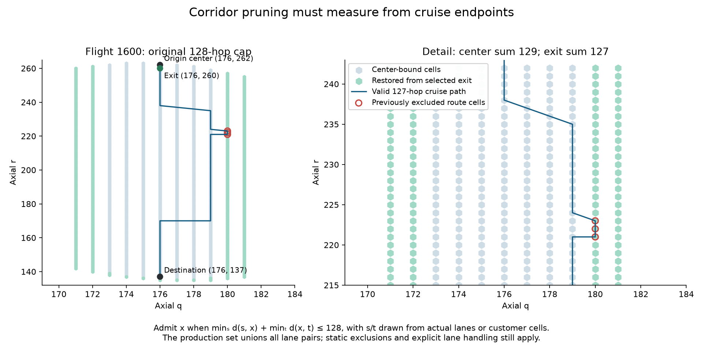

# Column generation: model, implementation, and measured performance

Column generation plans the batch jointly. A **column** is one flight's complete
hex-cell path, cruise level, terminal lanes, departure step, cost, and set of
occupied resources. The master chooses compatible columns; pricing finds useful
new columns. The implementation is in `freespace_sim/planner/colgen/`.

## The optimization problem

For flight \(f\), let \(P_f\) contain its allowed routes and departures, and let
\(x_{fp}\) select column \(p\). A resource row \(r\) identifies a cell/level/time
or terminal/time, with capacity \(u_r\). Define
\(a_{rfp}=\mathbf 1[r\in A_{fp}]\), where \(A_{fp}\) is the **union** of the
route's reservation claims. Overlapping contributions from one flight count once.
The fixed load \(l_r^{\mathrm{fixed}}\) counts already committed flights claiming
that row; it is zero in the outbound batch benchmarks below.

The code maximizes

\[
\max_x\sum_f\sum_{p\in P_f}(M-c_{fp})x_{fp},\qquad
\sum_{p\in P_f}x_{fp}\le1,\qquad
l_r^{\mathrm{fixed}}+\sum_f\sum_{p\in P_f}a_{rfp}x_{fp}\le u_r.
\]

The integer problem uses \(x_{fp}\in\{0,1\}\); its LP relaxation uses
\(x_{fp}\ge0\). Leaving a flight unselected is equivalent to paying denial
penalty \(M\) in the corresponding minimization problem. It is not a hard
requirement to accept every flight.

For departure step \(d_p\), requested base step
\(b_f=\lceil t_f/\Delta\rceil\), and time step \(\Delta\), column cost is

\[
c_{fp}=w_g(d_p-b_f)\Delta+
w_a\left(h_{fp}+\frac{\max(0,L_{fp}-L_f^{\mathrm{ref}})}{v}\right).
\]

`objective.py` owns this arithmetic. `Column.delay_s` stores the weighted cost
under `total_cost`, despite its historical name. CG routes currently have no
airborne holds, so \(h_{fp}=0\). Mandatory endpoint altitude cost is excluded
from this congestion objective. The detour reference is endpoint-aware enroute
distance; the search's hop limit uses the lattice distance instead.

## How the solver builds the schedule

1. **Seed the pool.** By default, construct nominal routes and up to 20 later
   departures. Optional FCFS A* imports can replace nominal initialization, with
   departure alternatives on both sides of each imported time. Imports are
   validated and repriced; routes containing airborne holds cannot be imported.
2. **Solve the restricted LP.** Its flight prices \(\pi_f\) and resource prices
   \(\lambda_r\) tell pricing what currently congested capacity costs.
3. **Price each flight.** Search for positive reduced cost
   \(M-c_{fp}-\pi_f-\sum_r\lambda_r a_{rfp}\). The goal-directed bootstrap
   finds an incumbent, restricted DP refines it, and full DP certifies pricing
   within the configured route domain. Workers handle different flights.
4. **Solve the restricted IP after each pricing round.** Newly added routes
   compete immediately in a feasible schedule, with the previous schedule as
   a MIP start on Gurobi. The default native search allowance is 30 seconds.
5. **Stop and finalize.** Exact pricing supplies the global LP bound. The LP
   target is 0.1%; the final IP has a separate allowance and optional reserved
   portion of the whole-solve budget. An optimal restricted IP proves optimality
   only over the generated columns, not over all ungenerated routes.

The default route allowance is six extra hops. Terminal corridors use the
actual exit/entry lane cells when bounding the cruise path; the 127-hop
regression covers the route previously excluded by endpoint pruning. DP labels
with different consumed hop counts remain distinct because their remaining
route budgets differ.

Optional cheap pricing can add useful columns, but only full exact sweeps update
the global bound or certify stopping. Optional multiple-column output returns
additional surviving candidates, not a general k-best enumeration. LNS
rearranges existing columns, including a small joint IP repair; it does not
generate routes. Both rounding and LNS are alternatives to the default per-round IP.

## What the runtime improvements reuse

**Spatial certificates** are local to one flight graph and configuration. The
key contains flight, path, level, and lanes, excluding departure time. The first
validation checks adjacent hops, corridor/lane membership, translated geometry,
detour budget, and permanent terminal-airspace conflicts. It stores claims and
endpoint time windows, not a certificate of compatibility with other flights.

For a legal departure shift \(s\), a claim \((\rho,\tau)\) normally becomes
\((\rho,\tau+s)\), giving \(A_{f,p+s}=T_s(A_{fp})\). The code checks endpoint
windows using the new absolute timestamp. If floating-point rounding changes a
window, it rebuilds claims while retaining spatial validation. Ground cost and
dual prices must be evaluated at the new time, and the master still enforces
all capacity constraints. Earlier departures must compute cost from the new
ground delay and preserved air component, avoiding cancellation below zero.

The certificate figures are reproducible through
`context/figures/make_figures.py::fig_colgen_certificate_reuse`, using production
claims and independent cold reconstruction without any archived input files.

`network.column_claims` implements spatial reuse; `pricing.certify_column`
validates cost and claims before a column can become a pricing cutoff.
`pricing_pool.certified_sweep_columns` lets the parent reuse only exact certified
objects tied to the matching request, graph, configuration, and objective.
Foreign or replaced outputs go through canonical validation.

**Pricing preparation** shares immutable topology, packed prices, forbidden
rows, and root calculations between bootstrap and full DP. Incumbent-dependent
bounds are rebuilt for each stage. The native bootstrap and sink bound screening
avoid Python work; complete route certification still checks actual geometry.
Native tie comparisons walk immutable parent chains without constructing whole
paths. Hash collisions and shared suffixes do not change lexicographic ordering.

**Capacity separation** uses the existing row-to-column index. It skips rows
already in the model and proves that some remaining rows cannot violate capacity
using per-flight positive LP mass. Conservative numerical checks retain a full
scan for unusual public inputs, changed fixed loads, and tight tolerances.

## Measured results and limits

The latest controlled comparison isolates capacity separation and worker
certification against branch commit `40c25e9`, which already contains the earlier
pricing improvements. Both arms used 1200 seconds of outbound FAA demand,
12 pricing workers, 4 Gurobi threads, six extra hops, one priced column per flight,
nominal plus 20 departure seeds, up to 30 rounds, and 30 seconds per-round IP.
The benchmark reserved 660 seconds for a final IP allowance of 600 seconds;
the production final-IP default remains 120 seconds.

| Seed | Flights | Total wall before → after | Pricing wall before → after | Final cost, both |
|---:|---:|---:|---:|---:|
| 0 | 1537 | 1198.65 → 1065.78 s (−11.08%) | 560.80 → 472.03 s | 156817.302553 |
| 1 | 1545 | 1499.89 → 1345.49 s (−10.29%) | 746.82 → 644.58 s | 161135.996334 |

All flights were accepted and independently conflict-verified. Ordered pricing
columns, costs, reduced costs, and paths matched in both pairs. The runs took
11 and 14 rounds, generating 42879 and 45568 columns. Finite-time IP selections
differed on seed 1 while aggregate cost remained identical. Final LP gaps were
0.0852% and 0.0717%; global integer cost gaps were 1.1826% and 0.8955%.

The optimized worker task averaged 277/274 ms per flight on seeds 0/1, including
bootstrap at 124/113 ms and the main compiled stage at 145/153 ms. These are
stage timings including wrapper/preparation work, not isolated native DP times.
The latest gain removes parent work; it does not demonstrate faster DP workers.

Earlier independent comparisons found about 7.38% lower full wall time from
path comparison changes and 7.35% from shared preparation plus compiled bootstrap.
These use different successive baselines and must not be added. A 25-second IP
cap helped seed 0 but required an extra round on seed 1; retain 30 seconds.
Each comparison has one serial trial per arm and seed, without a variance estimate.

See [the benchmark tools](../analysis/colgen/README.md) for reproduction and
[the consolidated evidence](../analysis/colgen/results.json) for precise values,
hashes, parity audits, historical validation, and original artifact locations.
Measurements predate the malformed-sweep guard and centered-departure cost fix;
the cleanup does not claim a new full-size benchmark. Further bootstrap and DP
ideas are deferred to [issue #132](https://github.com/victor-qin/congestion-utm-freespace/issues/132).

Dated notes, raw captures, and one-off scripts are local history under ignored
`.context/colgen/`, preserving their original `analysis/` and `context/` paths.
Previously committed evidence remains retrievable from commit `1df0c19`.
