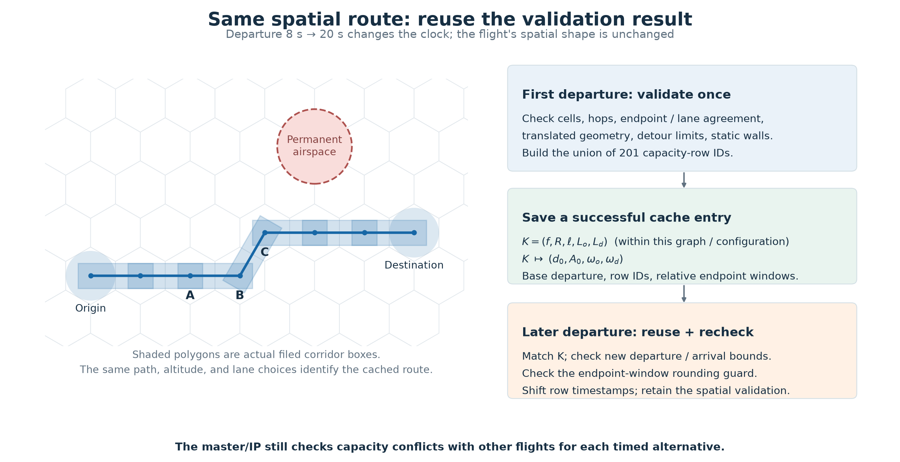
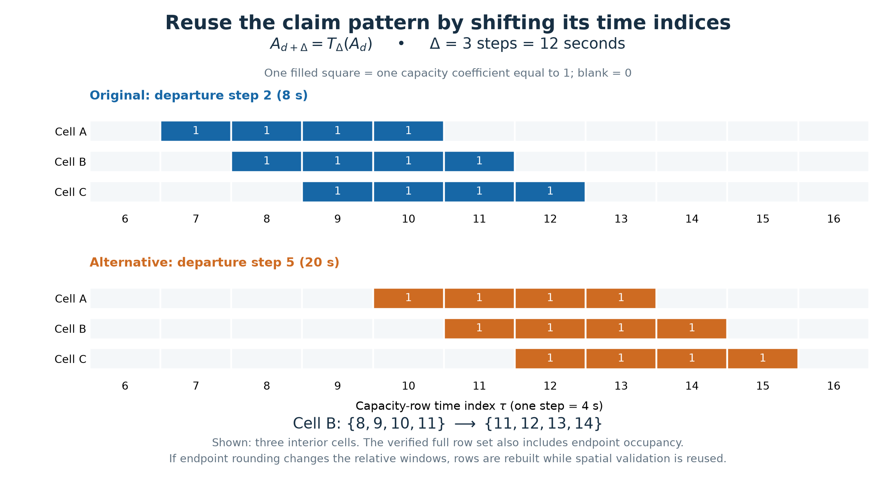

# Column certificate reuse

The cache records that an exact spatial route has already passed validation and stores
its capacity-row set. It does not store a proof of feasibility alongside other flights.
The master/IP must still enforce capacity at each alternative's actual times.

For flight $f$, let $R=(c_0,\ldots,c_H)$ be its ordered cell path, $\ell$ its level,
$L_o,L_d$ its terminal lane choices, and $d$ its departure step. In the fixed flight
graph and configuration, the cache key is

$$K=(f,R,\ell,L_o,L_d).$$

Departure is deliberately absent. The first successful call stores

$$K\mapsto(d_0,A_0,\omega_o,\omega_d),$$

where $A_0$ is a set of capacity-row IDs and $\omega_o,\omega_d$ are the endpoint
time-window bounds relative to departure. A successful entry means corridor membership,
neighbor hops, endpoint/lane agreement, canonical geometry translation, detour budgets,
and exact intersection checks against permanent terminal airspace passed. The ledger
box objects themselves are not cached here.

## Capacity coefficients and the shift

Let $s_R$ be the takeoff and origin-lane duration in steps. Interior cell $c_i$ is
visited at $d+s_R+i$. The benchmark configuration derives offsets
$W=\{-2,-1,0,1\}$ from reservation geometry; these offsets are configuration dependent.
The complete set includes origin and destination occupancy:

$$
A_{f,R,d}=A^o_{f,R,d}\cup
\bigcup_{i=0}^{H}\{(c_i,\ell,d+s_R+i+w):w\in W\}
\cup A^d_{f,R,d}.
$$

Each capacity coefficient is binary membership, so overlapping pieces are counted once:

$$a_{r f (R,d)}=\mathbf1[r\in A_{f,R,d}].$$

Write a row as $(\rho,\tau)$, where $\rho$ identifies a cell/level or a terminal,
and $\tau$ is its time step. Define $T_\Delta(\rho,\tau)=(\rho,\tau+\Delta)$.
For a legal shifted departure, when the endpoint-window guard passes,

$$A_{f,R,d+\Delta}=T_\Delta(A_{f,R,d}),$$
$$a_{(\rho,\tau),f,(R,d+\Delta)}=a_{(\rho,\tau-\Delta),f,(R,d)}.$$

This illustration uses production geometry and claim construction under the benchmark
configuration, with a small illustrative route rather than a benchmark flight. Moving
departure from 8 to 20 seconds shifts three 4-second steps. Cell B's rows move from
$\{8,9,10,11\}$ to $\{11,12,13,14\}$. All 201 full capacity claims match an independent
cold recomputation, and every filed volume retains its spatial shape and shifts its
time interval by 12 seconds. The base and cached alternative require one expensive
geometry translation in total.

## What is checked again

The code checks departure and arrival bounds and computes the endpoint windows using
the actual new timestamp. For each endpoint $e$, it checks

$$\omega_e(d)=(\mathrm{start}_e(d)-d,\mathrm{stop}_e(d)-d),\qquad
\omega_e(d+\Delta)=\omega_e(d).$$

If floating-point boundary rounding changes that relative window, it rebuilds the
capacity rows while retaining the successful spatial validation. A different path,
level, or lane cannot use this entry. The cache is local to one graph/configuration
and holds two routes; eviction can require later revalidation.

The master/IP still enforces

$$l^{\mathrm{fixed}}_r+\sum_f\sum_{p\in P_f}a_{rfp}x_{fp}\le u_r.$$

Ground-delay cost and the sum of dual prices over the new resource-times must also
be evaluated for the new column. Shifting claims is still linear in the number of
rows; the saving is avoided geometry construction and repeated spatial validation.

Implementation: `freespace_sim/planner/colgen/network.py::column_claims`.
Reproduce the figures and assertions with
`python analysis/illustrate_colgen_certificate_reuse.py`.
Numerical evidence is in `analysis/colgen_certificate_reuse_20260910/verified_example.json`.
